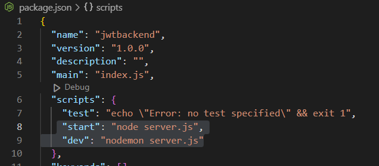
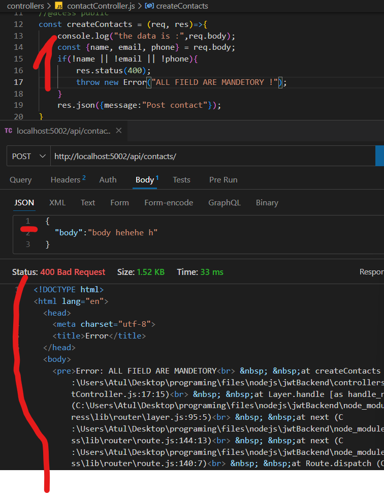

## Jwt backend

> npm init - y

> npm install express

> npm i -D nodemon

- nodemon -->
- mongoose --> mango db
- bcrypt --> to hash passwords
---

# structure

## nodemon

- automaticaly restart our server, whenever changes are made

- add script
  > npm run dev
  > 

## .env

- contains private vairables

> npm i dotenv

- this is going to help us to fetch the env file, with the help of process module which is a core module of node.js

.env

```js
PORT = 5002;
```

server.js

```js
const doenv = require("dotenv").config();

const port = process.env.PORT || 5000;
```

## middleware

### data parser
> app.use(express.json());

- it provide a parser that parse the data stream
- when ever we need to acept data from client we need to use body parser. that can parse the stream of data that we are receiving from the client.
---
### express-async-handler
> npm i express-async-handler
```

```

## routes

- define all routes here

-

## controllers

- contains all our logic for request response.
- whenever we create a api methods we always need to give some labels to that

## error handeling

- as error are throw in HTML formate, to make it in json formate, need to use middelware
  which is going to accept the error and convert it in json formate
  

- define constants in constants.js

```js
exports.constants = {
    VALIDATION_ERROR: 400,
    UNAUTHERIZED: 401,
    FORBIDDEN: 403,
    NOT_FOUND: 404,
    SERVER_ERROR:500
}
```

- make a switch for status code

```js
const { constants } = require("../constants");
const errorHandler = (err, req, res, next) => {
  // if status is given pass it, or pass the 500
  const statusCode = res.statusCode ? res.statusCode : 500;
  switch (statusCode) {
    case constants.VALIDATION_ERROR:
      res.json({
        title: "Validation failed",
        message: err.message,
        stackTrace: err.stack,
      });
    case constants.UNAUTHERIZED:
      res.json({
        title: "Validation failed",
        message: err.message,
        stackTrace: err.stack,
      });

    default:
      console.log("No error");
      break;
  }
};

module.exports = errorHandler;
```

## Mongodb

- whenever we intract with mongodb we get a promise, to resolve promise we use async
- to catch error in async, use try catch bolck. instead of adding try catch in each async function we use a middelware(express-async-handler) to handle it.

> npm i mongoose

### hwo to connect with mongo db
- connection string
- connect to db dbConnection.js

### mongoose schema
- define a schema
- contactModel.js

### CRUD


